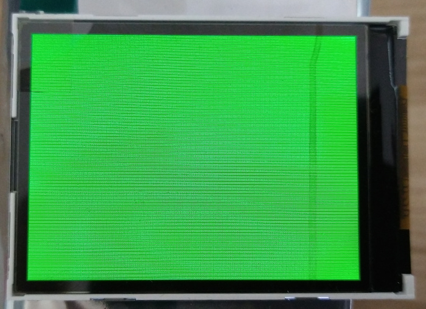
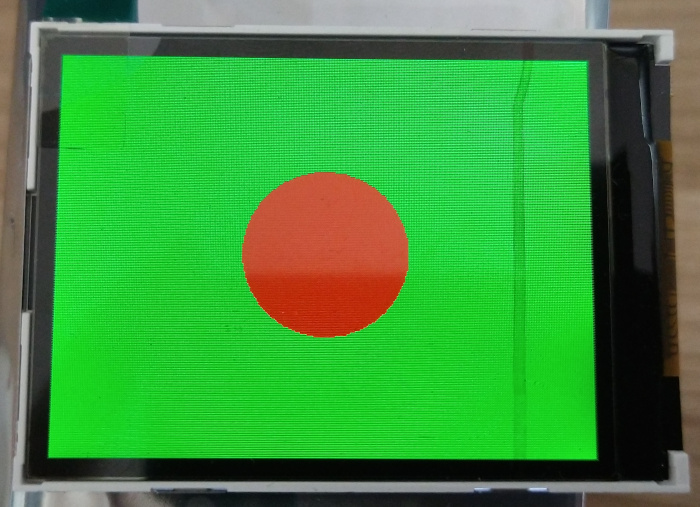
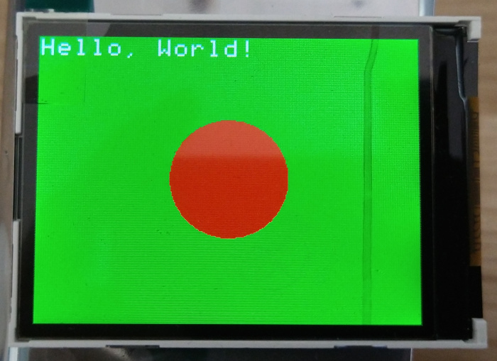
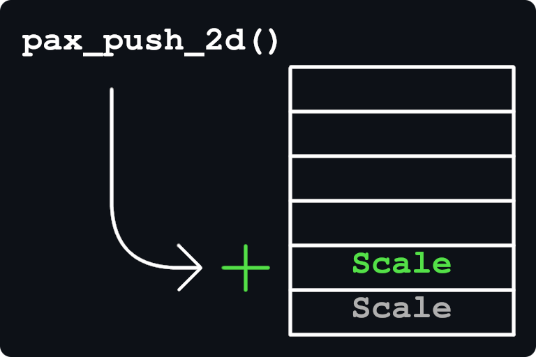
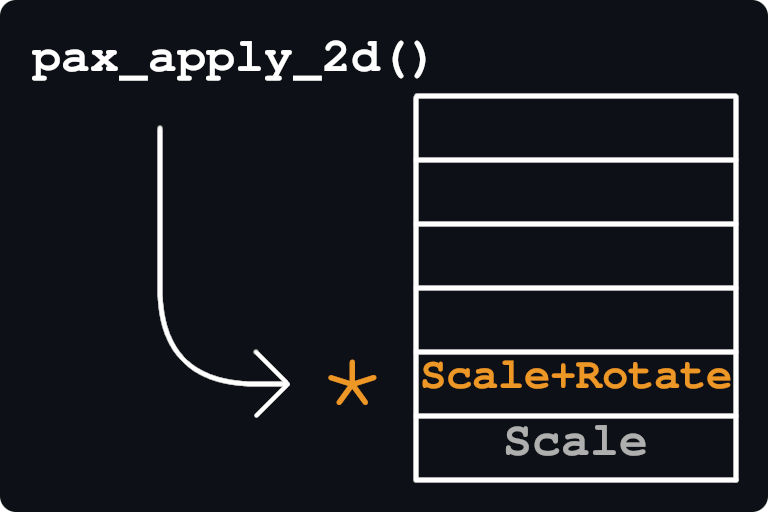
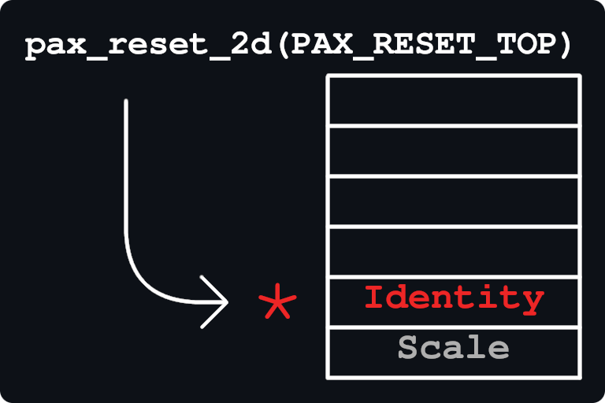
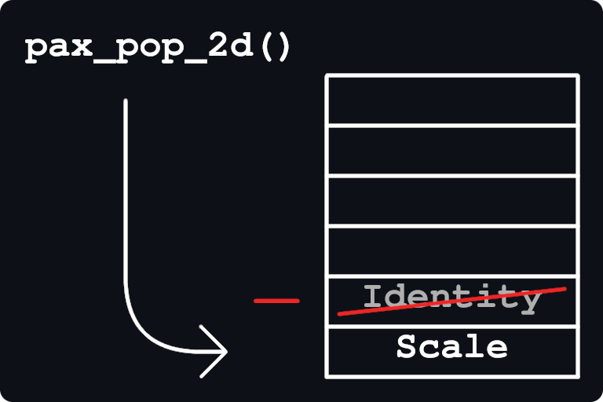

# PAX graphics documentation: Core API

The PAX graphics stack is the official graphics library for [Badge.team badges since MCH2022](../supported-platforms.md).
It's goal is to allow anyone to, in C, use a powerful list of drawing features with good optimisation.

This library is the successor of the revised graphics API for [the old badge.team firmware](https://github.com/badgeteam/ESP32-platform-firmware).

For supported platforms, [see this link](../supported-platforms.md).

## PAX Docs overview
- [Getting started](#getting-started)
- [API overview](#api-overview)
- [API reference](#api-reference)
    - [Setup](#api-reference-setup)
    - [Basic drawing](#api-reference-basic-drawing)
    - [Colors](#api-reference-colors)
    - [Text](#api-reference-text)
- [Advanced API reference](#api-reference-advanced-features)
    - [Clipping](#api-reference-clipping)
    - [Matrix transformations](#api-reference-matrix-transformations)
    - [Shaders](#api-reference-shaders)
    - [Buffer orientation](#api-reference-orientation)

# Getting started

Let's get started with a simple example.

In this example, we'll make a green background with a red circle in the middle and some white text in the top left corner.

First, the setup.<br>
In each file you'd like to use PAX graphics in, you'll need to include the `pax_gfx` header: 
```c
// Include the PAX graphics library.
#include <pax_gfx.h>
```

The [`pax_buf_init`](#api-reference-setup) function is used to create a new graphics environment.

Here, we use it with the type PAX_BUF_16_565RGB and reversed endianness, which is appropriate for the screen used by the MCH2022 badge.
```c
void my_graphics_function() {
    // Setup.
    pax_buf_t gfx;
    pax_buf_init(&gfx, NULL, 320, 240, PAX_BUF_16_565RGB);
    pax_buf_reversed(&gfx, true);
}
```
This tells PAX to create a framebuffer for the screen, which is 320 by 240 pixels in size.

Next, let's make a nice, green background.
You can use [many methods](#api-reference-colors) of picking a color,
but we'll go with [`pax_col_rgb`](#api-reference-colors "Combines RGB channels").
The [`pax_background`](#api-reference-basic-drawing) method fills the background with the desired color, like so:
```c
void my_graphics_function() {
    // Setup.
    pax_buf_t gfx;
    pax_buf_init(&gfx, NULL, 320, 240, PAX_BUF_16_565RGB);
    pax_buf_reversed(&gfx, true);
    
    // Green background.
    pax_background(&gfx, pax_col_rgb(0, 255, 0));
}
```
Here's what it looks like if you write it to the screen:


To draw a circle, you use [`pax_draw_circle`](#api-reference-basic-drawing) or [`pax_simple_circle`](#api-reference-basic-drawing)
with a midpoint co-ordinates and the radius:
```c
void my_graphics_function() {
    // Setup.
    pax_buf_t gfx;
    pax_buf_init(&gfx, NULL, 320, 240, PAX_BUF_16_565RGB);
    pax_buf_reversed(&gfx, true);
    
    // Green background.
    pax_background(&gfx, pax_col_rgb(0, 255, 0));
    
    // Red circle.
    float midpoint_x = pax_buf_get_width(gfx) / 2.0;  // Middle of the screen horizontally.
    float midpoint_y = pax_buf_get_height(gfx) / 2.0; // Middle of the screen vertically.
    float radius     = 50;                            // Nice, big circle.
    pax_simple_circle(&gfx, pax_col_rgb(255, 0, 0), midpoint_x, midpoint_y, radius);
}
```
Here's what it looks like if you write it to the screen:


Text is a bit more complicated, because you get to pick a font.
However, you can pick any font for now. We'll go with `pax_font_sky_mono`.<br>
It's point size is 9, which means that a text size of 9 is it's normal look. We'll pick 18 for readability.<br>
The [`pax_draw_text`](#api-reference-text) method is used to draw text.
It accepts a font, a point size, a top left corner position and the text to draw:
```c
void my_graphics_function() {
    // Setup.
    pax_buf_t gfx;
    pax_buf_init(&gfx, NULL, 320, 240, PAX_BUF_16_565RGB);
    pax_buf_reversed(&gfx, true);
    
    // Green background.
    pax_background(&gfx, pax_col_rgb(0, 255, 0));
    
    // Red circle.
    float midpoint_x = pax_buf_get_width(gfx) / 2.0;  // Middle of the screen horizontally.
    float midpoint_y = pax_buf_get_height(gfx) / 2.0; // Middle of the screen vertically.
    float radius     = 50;                            // Nice, big circle.
    pax_simple_circle(&gfx, pax_col_rgb(255, 0, 0), midpoint_x, midpoint_y, radius);
    
    // White text.
    float text_x     = 0;                   // Top left corner of the screen.
    float text_y     = 0;                   // Top left corner of the screen.
    char *my_text    = "Hello, World!";     // You can pick any message you'd like.
    float text_size  = 18;                  // Twice the normal size for "sky".
    pax_draw_text(&gfx, pax_col_rgb(255, 255, 255), pax_font_sky_mono, text_size, text_x, text_y, my_text);
}
```
Here's what it looks like if you write it to the screen:


Next, you'll want to draw this to the screen.<br>
This differs per screen type, but for the MCH2022 badge's screen you use the
[`ili9341_write`](https://github.com/Nicolai-Electronics/esp32-component-spi-ili9341/ "Link on github") method.
```c
void my_graphics_function() {
    // Setup.
    pax_buf_t gfx;
    pax_buf_init(&gfx, NULL, 320, 240, PAX_BUF_16_565RGB);
    
    // Green background.
    pax_background(gfx, pax_col_rgb(0, 255, 0));
    pax_buf_reversed(gfx, true);
    
    // Red circle.
    float midpoint_x = pax_buf_get_width(gfx) / 2.0;  // Middle of the screen horizontally.
    float midpoint_y = pax_buf_get_height(gfx) / 2.0; // Middle of the screen vertically.
    float radius     = 50;                            // Nice, big circle.
    pax_simple_circle(gfx, pax_col_rgb(255, 0, 0), midpoint_x, midpoint_y, radius);
    
    // White text.
    float text_x     = 0;                   // Top left corner of the screen.
    float text_y     = 0;                   // Top left corner of the screen.
    char *my_text    = "Hello, World!";     // You can pick any message you'd like.
    float text_size  = 18;                  // Twice the normal size for "sky".
    pax_draw_text(gfx, pax_col_rgb(255, 255, 255), pax_font_sky_mono, text_size, text_x, text_y, my_text);
    
    // Put it on the screen.
    if (ili9341_write(&display, pax_buf_get_pixels(gfx))) {
        ESP_LOGE("my_tag", "Display write failed.");
    } else {
        ESP_LOGI("my_tag", "Display write success.");
    }
}
```
The code we just added is the actual code which writes your beautiful creation to the screen.<br>
If you use a different screen, you'll need to find it's documentation for which type of buffer it wants and how you write to it.

Finally, there's cleanup.<br>
If you don't want to use the buffer you made during setup anymore, you can clean it up with
[`pax_buf_destroy`](#api-reference-setup "Frees any memory assigned to the buffer").
```c
void my_graphics_function() {
    // Setup.
    pax_buf_t gfx;
    pax_buf_init(&gfx, NULL, 320, 240, PAX_BUF_16_565RGB);
    
    // Green background.
    pax_background(&gfx, pax_col_rgb(0, 255, 0));
    pax_buf_reversed(&gfx, true);
    
    // Red circle.
    float midpoint_x = pax_buf_get_width(&gfx) / 2.0;  // Middle of the screen horizontally.
    float midpoint_y = pax_buf_get_height(&gfx) / 2.0; // Middle of the screen vertically.
    float radius     = 50;                             // Nice, big circle.
    pax_simple_circle(&gfx, pax_col_rgb(255, 0, 0), midpoint_x, midpoint_y, radius);
    
    // White text.
    float text_x     = 0;                   // Top left corner of the screen.
    float text_y     = 0;                   // Top left corner of the screen.
    char *my_text    = "Hello, World!";     // You can pick any message you'd like.
    float text_size  = 18;                  // Twice the normal size for "sky".
    pax_draw_text(&gfx, pax_col_rgb(255, 255, 255), pax_font_sky_mono, text_size, text_x, text_y, my_text);
    
    // Put it on the screen.
    if (ili9341_write(&display, pax_buf_get_pixels(&gfx))) {
        ESP_LOGE("my_tag", "Display write failed.");
    } else {
        ESP_LOGI("my_tag", "Display write success.");
    }
    
    // Cleanup.
    pax_buf_destroy(&gfx);
}
```


# API overview

An overview of the PAX API methods.
The API is split into a few groups:
- [Environment setup](setup.md)
    - How to set up a framebuffer
    - How to apply clipping
    - How to clean up after yourself
- [Basic drawing](drawing.md)
    - Drawing with basic shapes
    - Drawing text
    - Drawing images
    - Drawing using shaders
- [Colors and color math](colors.md)
    - Creating colors
    - Performing color math
- [Matrix transformations](matrices.md)
    - Applying transformations
    - Using the matrix stack
- [Shaders](shaders.md)
    - Using shaders
    - List of shaders
    - Creating shaders
- [Image codecs](codecs.md)
    - Decoding PNG images
    - Requires a [seperate component](https://github.com/robotman2412/pax-codecs)
- [Misc. features](misc.md)
    - [Endianness](misc.md#endianness)
    - [Clipping](misc.md#clipping)
    - [Dirty area](misc.md#dirty-area)
    - [Rotation](misc.md#screen-rotation)
    - [Scrolling](misc.md#scrolling)
    - [Pixel setting](misc.md#pixel-setting)
    - [Multi-core rendering](misc.md#multi-core-rendering)

# API reference

A reference for how to use certain features.

## API reference: Setup

For setting up a buffer, use [`pax_buf_init`](setup.md#buffer-creation):
For the MCH2022 badge, the size is 320x240, the format is [`PAX_BUF_16_565RGB`](setup.md#buffer-formats) and the endianness is reversed.
```c
// Create a graphics context:
pax_buf_t gfx;
pax_buf_init(&gfx, memory, width, height, format);
```
If you want, you can use a different type for intermediary buffers (e.g. to store image textures):
- [`PAX_BUF_32_8888ARGB`](setup.md#buffer-formats)
- [`PAX_BUF_16_4444ARGB`](setup.md#buffer-formats)
- [`PAX_BUF_8_2222ARGB`](setup.md#buffer-formats)
- [`PAX_BUF_8_332RGB`](setup.md#buffer-formats)
- [other color formats](setup.md#buffer-formats)

PAX converts colors automatically for you.

Since the MCH2022 badge uses a display with an endianness opposite to that of its CPU,
you'll want to enable reversed endianness mode to get the correct colors. On other platforms, whether you need this depends on your own CPU and display.
```c
// Enable reversed endianness mode, which is disabled by default:
pax_buf_reversed(gfx, true);
```

When you're done and you won't use a given buffer anymore, you can use [`pax_buf_destroy`](setup.md#buffer-creation):
PAX will automatically free any memory it used for the buffer.
```c
// Clean up everything in and including `gfx`:
pax_buf_destroy(gfx);
```

## API reference: Colors

PAX has a small collection of color functions for creating and modifying colors.

For simple colors, [`pax_col_rgb`](colors.md#color-rgb) or [`pax_col_argb`](colors.md#color-rgb) are usually the appropriate functions:
```c
pax_col_t color_0 = pax_col_argb(alpha, red, green, blue);
pax_col_t color_1 = pax_col_rgb (red, green, blue);
```

You can also use [`pax_col_hsv`](colors.md#color-hsv) or [`pax_col_ahsv`](colors.md#color-hsv) to convert HSV to RGB:
```c
pax_col_t color_2 = pax_col_ahsv(alpha, hue, saturation, brightness);
pax_col_t color_3 = pax_col_hsv (hue, saturation, brightness);
```

Otherwise, you can specify it in hexadecimal with the `0xAARRGGBB` format:
```c
pax_col_t color_4 = 0xff7f3f1f;
```

Finally, there's [functions for merging colors](colors.md#color-merging).

## API reference: Basic drawing

In PAX, you can opt to draw shapes in different ways:
- [Simple](drawing.md#simple-drawing) (ignoring [transforms](#api-reference-matrix-transformation) and with a color)
- [Normal](drawing.md#normal-drawing) (with a color or with an image)
- [Outline](drawing.md#outline-drawing) (the outline of a shape)
- [Shaded](drawing.md#shaded-drawing) (with a shader for some specific look, for advanced users)

What variant is best for you?
- You want to draw a line of some form around something?
    - Outline.
- You want to draw a simple menu with just some text and basic shapes?
    - Simple (you probably won't need to use transformations, but you could).
- You want to add something more complex than a single color?
    - Shaded (you can even [make your own shader](shaders.md#making-your-own-shader)).
- You want to draw an image?
    - Normal.
- Anything else with just one color per shape?
    - Normal.

There are five basic shapes you can draw:
| shape     | simple              | normal            | outline              | with shader
| :-------- | :------------------ | :---------------- | :------------------- | :----------
| rectangle | `pax_simple_rect`   | `pax_draw_rect`   | `pax_outline_rect`   | `pax_shade_rect`
| line      | `pax_simple_line`   | `pax_draw_line`   | Not available.       | Not available.
| triangle  | `pax_simple_tri`    | `pax_draw_tri`    | `pax_outline_tri`    | `pax_shade_tri`
| circle    | `pax_simple_circle` | `pax_draw_circle` | `pax_outline_circle` | `pax_shade_circle`
| arc       | `pax_simple_arc`    | `pax_draw_arc`    | `pax_outline_arc`    | `pax_shade_arc`

Each method here consists of a set of arguments based on the shape:
| shape     | arguments                      | description
| :-------- | :----------------------------- | :----------
| rectangle | `x, y, width, height`          | top left corner of rectangle
| line      | `x0, y0, x1, y1`               | both points that define the line
| triangle  | `x0, y0, x1, y1, x2, y2`       | all three points that define the triangle
| circle    | `x, y, radius`                 | midpoint of circle and radius
| arc       | `x, y, radius, angle0, angle1` | arc from angle0 to angle1 in radians, with midpoint and radius (angles start to the right and go counterclockwise)

You can also draw images:
| name                 | arguments                          | description
| :------------------- | :--------------------------------- | :----------
| pax_draw_image       | image, x, y                        | Draws an image at the image's normal size.
| pax_draw_image_sized | image, x, y, width, height         | Draw an image with a prespecified size.

### In case you do use shaders

If the method is one of the `pax_shade_` methods, two additional arguments are added after `color`:
- `pax_shader_t *shader, pax_quadf *uvs` (Except triangle)
    - Circles and arcs behave as though they are a cutout of a rectangle (in terms of UVs).
    - Rectangle UVs 0 -> 3 are the corners: top left, top right, bottom right, bottom left.
- `pax_shader_t *shader, pax_trif  *uvs` (Triangle only)
    - Triangles define their UVs per point.

UVs are "texture co-ordinates" in the computer graphics world.
They are floating-point and range from 0 to 1.
It is up to the shader to turn these into pixel co-ordinates for e.g. adding a texture to a shape.

Note: It is acceptable for a rectangle to have a negative width and/or height.

## API reference: Text

In PAX, you can use different fonts for text (even though there's only one font called "7x9" for now).
You draw text by using [`pax_draw_text`](text.md#drawing-text):
```c
// Draw some text.
pax_draw_text(gfx, color, font, font_size, x, y, text);
```
Font is usually [`PAX_FONT_DEFAULT`](text.md#fonts) or another [`PAX_FONT_`](text.md#fonts).<br>
The `font_size` is the line height: 9 by default for the font "7x9".
If this number is 0, the font's default size is used.

You can also calculate the size of a given string with [`pax_text_size`](text.md#text-size):
```c
// Get the size of some text.
pax_vec2f size = pax_text_size(font, font_size, text);
float text_width  = size.x;
float text_height = size.y;
```
The font_size is the same as the line height for drawing text.

The text features also respect newlines (in the forms of `\n`, `\r\n` or `\r`).

# API reference: Advanced features

The flagship features of PAX are also the more difficult to use, so here's a basic overview:
- There is a [clipping system](#api-reference-clipping), used to isolate drawing to just a small part of the screen,
- There are [matrix transformations](#api-reference-matrix-transformations), used to distort and move around everything you draw,
- Finally, there are [shaders](#api-reference-shaders), used to add an image to a shape or for more complex coloring of shapes.

## API reference: Clipping

When you apply clipping, PAX acts as if the buffer is smaller than it might in reality be.<br>
Clipping can be useful if you want to e.g. draw a big shape but prevent it from overlapping with another area.
Clipping redefines the rectangle in which you can draw.

To apply clipping, use [`pax_clip`](drawing.md#clipping):
```c
// Apply clipping. Automatically fixes negative width and/or height.
pax_clip(gfx, x, y, width, height);
```

To remove clipping (AKA be able to draw on the entire buffer again), use [`pax_noclip`](drawing.md#clipping):
```c
// Remove clipping.
pax_noclip(gfx);
```

## API reference: Matrix transformations

Imagine this: You just painstakingly created some vector graphics, but they're too big to fit.
You could re-do all that work, or you could take advantage of transformations.<br>
In PAX, transformations apply to all method starting with `pax_draw_` or `pax_shade_`.
They can be used to re-size, rotate and move shapes around.

First, you need to know what a stack is. <br>
In simple terms, a stack is like a bunch of paper in a box:
You can grab only the top piece of paper, and you can only add paper to the top.<br>
This is like method calls in C: The method you call won't modify your variables unless you want it to.

Let's start with a visual example.
Here, you see an initial situation: a scale matrix has been applied.
<br>
Let's say we want to do something else, but we need this matrix later.
To do this, you'll need to push the matrix stack.

Now, to push the stack, use [`pax_push_2d`](matrices.md#matrix-stack):
```c
// Push the matrix stack. Duplicates the top matrix.
pax_push_2d(gfx);
```


At this point, it's safe to perform some operation.
Let's say a rotation happened.


But what if you want no transformation but still to remember the old ones?<br>
You use [`pax_reset_2d`](matrices.md#matrix-stack) with the argument `PAX_RESET_TOP`:
```c
// Reset the top matrix.
// A matrix that represents no transformation is also called the 'identity' matrix.
pax_push_2d(gfx, PAX_RESET_TOP);
```


Finally, you want to use the initial matrix again.
For this, you need to pop the stack.<br>
Use [`pax_pop_2d`](matrices.md#matrix-stack):
```c
// Pop the matrix stack.
pax_pop_2d(gfx);
```


### Transformation options

Now that you know what the stack is,
you can use [`pax_apply_2d`](matrices.md#applying-matrices) to perform a transformation:
```c
// You can do as many in a row as you'd like.
pax_apply_2d(gfx, my_perfect_transformation);
```

Let's say you'd like to change the scale of the vector graphics you made.
For this, you use [`matrix_2d_scale`](matrices.md#types-of-matrices):
```c
pax_apply_2d(gfx, matrix_2d_scale(x_scale, y_scale));
// Draw your things that need to be scaled here.
```

But now, you decide you want it placed elsewhere.
To move around things, use [`matrix_2d_translate`](matrices.md#types-of-matrices):
```c
// By scaling, you are multiplying the size by the given factors.
pax_apply_2d(gfx, matrix_2d_translate(x_offset, y_offset));
```

There's also the fancy rotation matrix [`matrix_2d_rotate`](matrices.md#types-of-matrices):
```c
// Angle is in radians, positive angles rotate everything counterclockwise.
pax_apply_2d(gfx, matrix_2d_rotate(angle));
```

## API reference: Shaders

The [shader](shaders.md) is PAX' most advanced feature.<br>
Internally, they are used for boring things like drawing text, but you can truly turn it into anything you'd like.

The way most users will see shaders is with [`PAX_SHADER_TEXTURE`](shaders.md#built-in-shaders):
```c
pax_shader_t my_texture_shader = PAX_SHADER_TEXTURE(my_texture);
```

You can also make your own shaders, for example one that shows some nice rainbows:
```c
// The shader callback.
pax_col_t my_shader_callback(pax_col_t tint, int x, int y, float u, float v, void *args) {
    return pax_col_hsv(x / 50.0 * 255.0 + y / 150.0 * 255.0, 255, 255);
}

// The shader object.
pax_shader_t my_shader = {
    .callback          = my_shader,
    .callback_args     = NULL,
    .alpha_promise_0   = false,
    .alpha_promise_255 = true
};
```
The `callback_args` property is passed directly to the selected callback as the `args` parameter.

For more information on how to make and use your own shaders, and how the `alpha_promise_` attributes work, see [shaders.md](shaders.md#making-your-own-shaders).

## API reference: Orientation

The [orientation](orientation.md) feature is designed to help with changing the orientation of or mirroring displays. It effectively transforms all drawing APIs with the appropriate orientation to make supporting displays with any orientation or order of framebuffer easier.

Take, for example, the 128x64 SSD1306 display: Its framebuffer orientation starts at the bottom right corner and goes bottom to top, right to left.
To use this display, make an appropriate framebuffer and set the orientation to the inverse of what the display uses (counter-clockwise rotation then flip horizontally):
```c
// Create a buffer for the SSD1306 display.
void create_my_buffer(pax_buf_t *gfx) {
    // Create the buffer matching the screen.
    // Notice that the screen is physically 128x64, but logically 64x128.
    pax_buf_init(gfx, NULL, 64, 128, PAX_BUF_1_GRAY);
    // Apply the orientation to allow the rest of the code to draw for a 128x64 display.
    pax_buf_set_orientation(gfx, PAX_O_ROT_CCW_FLIP_H);
}
```
